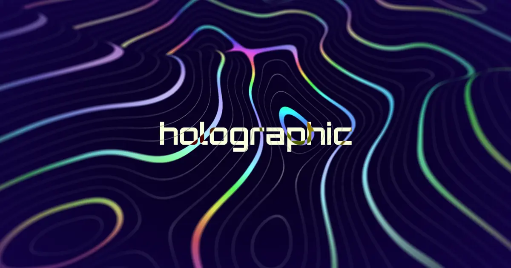

# WebGL Holographic Terrain

### [Bruno Simon - Learn with elevation lines in JavaScript using WebGL with Three.js](https://www.youtube.com/watch?v=DnBYm6-D9NU&t=6434s&ab_channel=BrunoSimon)

-   VUE + Three.js
-   [Vite Plugin GLSL](https://www.npmjs.com/package/vite-plugin-glsl) - Import, inline GLSL shader files

[demo](https://happy-balloon.zeabur.app/)
